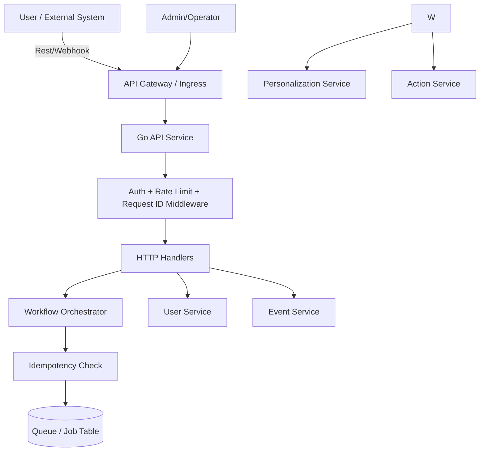

# Production-Ready Architecture

```mermaid
flowchart TB
    U[User / External System] -->|Rest/Webhook| G[API Gateway / Ingress]
    A[Admin/Operator] --> G
    
    G --> API[Go API Service]
    API --> AUTH[Auth + Rate Limit + Request ID Middleware]
    AUTH --> H[HTTP Handlers]
    H --> WF[Workflow Orchestrator]
    H --> US[User Service]
    H --> ES[Event Service]
    
    WF --> IDEM[Idempotency Check]
    IDEM --> Q[(Queue / Job Table)]
    W --> PERS[Personalization Service]
    W --> ACT[Action Service]
    
```
